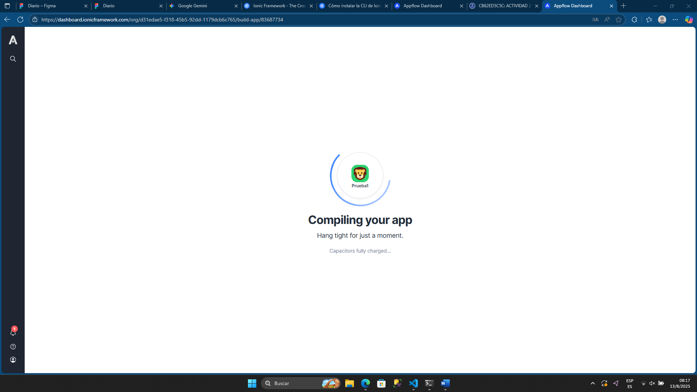
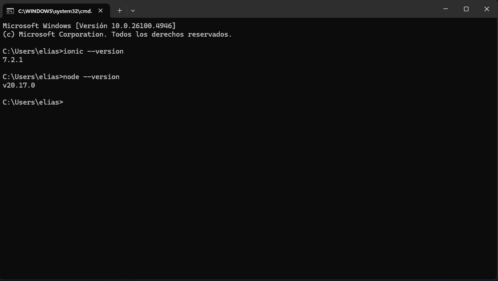
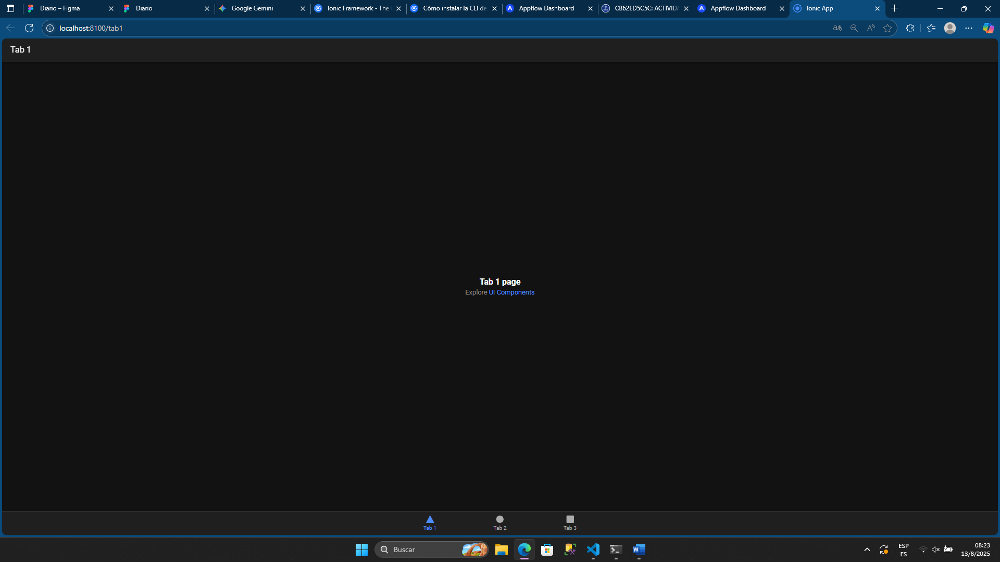

# Prueba-1

Este proyecto es una aplicación creada con Ionic y Vite.

## Requisitos previos

- Node.js (recomendado v16 o superior)
- npm (v8 o superior)
- Ionic CLI (instalar con `npm install -g @ionic/cli`)

## Instalación

1. Clona el repositorio o descarga el código fuente.
2. Abre una terminal en la carpeta del proyecto.
3. Instala las dependencias:

```bash
npm install
```

## Ejecución en desarrollo

Para iniciar la aplicación en modo desarrollo, ejecuta:

```bash
ionic serve
```

Esto abrirá la aplicación en tu navegador predeterminado.

```
```
## Imágenes de pruebas

```





Asegúrate de que la ruta sea correcta y que la imagen exista en la carpeta indicada.

---

Si tienes dudas, consulta la [documentación oficial de Ionic](https://ionicframework.com/docs/intro/cli) o la [documentación de Cypress](https://docs.cypress.io/).
